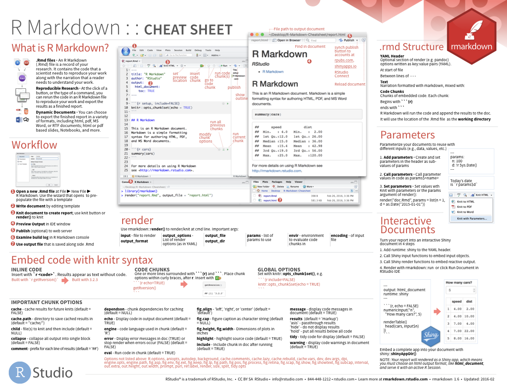

```{r setup, include=FALSE}
# Author: Tina Fu
# Original Date: March 2021
# Version of R: 3.6.1

# See here for learnr package documentation: https://rstudio.github.io/learnr/

# Include packages here that are required throughout the training
library(learnr)         # Required to build the Shiny app
# library(gradethis)      # Required for specific code checking and specific feedback

knitr::opts_chunk$set(echo = FALSE)

# tutorial_options(
#   exercise.checker = gradethis::grade_learnr
# )

# Formatting text table
annotation <- c("#", "##", "###", "\\*italics\\*", "\\*\\*bold\\*\\*", "\\* bulleted list")
formatting <- c("Header 1", "Header 2", "Header 3", "Format text to italics", "Format text to bold", "Create bulleted list")

formattext <- data.frame(Annotation = annotation, Formatting = formatting, stringsAsFactors = FALSE)
```

```{r phs-logo, fig.align='right', out.width="40%"}
knitr::include_graphics("images/phs-logo.png")
```

## Introduction

Welcome to an introduction to R Markdown. This course is designed as a self-led introduction to R Markdown for anyone in Public Health Scotland.

::: {.info_box}
<h4>

Course Info

</h4>

<ul>

<li>

This course is built to flow through sections and build on previous knowledge. If you're comfortable with a particular section, you can skip it.

</li>

<li>

Some sections have multiple parts to them. Navigate the course by using the buttons at the bottom of the screen to Continue or go to the Next Topic.

</li>

<li>

The course will also show progress through sections, a green tick will appear on sections you've completed, and it will remember your place if you decide to close your browser and come back later.

</li>

</ul>
:::

</br>

### What is R Markdown?

R Markdown provides an authoring framework for data science. You can use a single R Markdown file to

-   save and execute code
-   generate high quality reports that can be shared with an audience
-   make the report reproducible

R Markdown documents are fully reproducible and support dozens of static and dynamic output formats. This 1-minute video provides a quick tour of what's possible with R Markdown: 

### Knowledge Check

```{r intro-quiz}
quiz(
  question("Which of the following can R Markdown do?",
    answer("Generate reproducible reports", correct = TRUE),
    answer("Produce slides, dashboards, webpages, books", correct = TRUE),
    answer("Produce COVID-19 vaccine"),
    answer("Embed code chunks to save and execute code", correct = TRUE),
    incorrect = "Not quite, have another go!",
    allow_retry = TRUE,
    random_answer_order = TRUE
  )
)
```

## How it Works

### Create an R Markdown File

To create an R Markdown file, go to *File \> New File \> R Markdown*. Give it a title you want. For the default output format, you can choose from HTML, PDF or Word, which will be the file type you want the report to be. If you choose Word and click OK, it will look like this - a plain text file has the extension .Rmd.

```{r howitworks, fig.align='center', out.width="100%"}
knitr::include_graphics("images/r-howitworks.png")
```

### Type of Content

An R Markdown file contains three types of content:

#### YAML metadata

This section is to guide the R Markdown build process. It comes with a YAML header surrounded by `---` s. In this section you can have information such as title, author, output format.

````
---
title: "R Markdown Demo"
author: "My Name"
date: "10/05/2021"
output: word_document
---
````

#### Text 

You can display text mixed with simple [text formatting](#formattext).

#### Code chunks

You can write and run R code as you usually do. They are embedded in R code chunks surrounded by ```` ``` ```` s. You should give it a unique chunk name next to "r" as best practice. The following example is to create a summary statistics for dataset "cars". The chunk name is called "cars".

````
```{r cars}`r ''`
summary(cars)
```
````

More information will be available in the section [Code Chunks](#codechunks).

## Markdown Basics{#formattext}

### Format Text

You can format the text in your R Markdown file with [Pandoc's Markdown](https://rmarkdown.rstudio.com/authoring_pandoc_markdown.html), a set of markup annotations for plain text files. 

Here are some commonly used formatting:

```{r formattext_flextable, ft.align = "left", warning=FALSE, message=FALSE}
library(knitr)
library(kableExtra)

kable(formattext, align = "c", booktabs = TRUE) %>% 
  kable_styling("striped")
```

More about the format text please refer to the [R Markdown Cheatsheet](https://www.rstudio.com/wp-content/uploads/2016/03/rmarkdown-cheatsheet-2.0.pdf?_ga=2.84009817.1909559413.1615196547-221181954.1612528976).

### Visual Markdown Editor

In the latest version of RStudio you can also edit the text format by switching to visual markdown editor mode. It has user friendly interface to edit the text in the document, just like MS Word. Click "A" on the toolbar to switch. You can come back to the source editor by pressing the same button and see the source code contain the changes you just edited.

```{r markdowneditor, fig.align='center', out.width="50%"}
knitr::include_graphics("images/r-markdowneditor.png")
```

## Code Chunks{#codechunks}

As mentioned R code chunks can be embedded into an R Markdown file.

You can quickly insert chunks like these into your file with

-   the keyboard shortcut **Ctrl + Alt + I** (OS X: **Cmd + Option + I**)
-   the Add Chunk  command in the editor toolbar
-   manually typing the chunk delimiters ```` ```{r} and ``` ````.

When you render your .Rmd file, R Markdown will run each code chunk and embed the results beneath the code chunk in your final report.

### Chunk Options

Chunk output can be customized with arguments set in the `{}` of a chunk header. These are the commonly used arguments:

-   `include = FALSE` prevents code and results from appearing in the finished file. R Markdown still runs the code in the chunk, and the results can be used by other chunks.
-   `echo = FALSE` prevents code, but not the results from appearing in the finished file. This is a useful way to embed figures.
-   `message = FALSE` prevents messages that are generated by code from appearing in the finished file.
-   `warning = FALSE` prevents warnings that are generated by code from appearing in the finished file.
-   `fig.cap = "..."` adds a caption to graphical results.

See the [R Markdown Reference Guide](https://www.rstudio.com/wp-content/uploads/2015/03/rmarkdown-reference.pdf?_ga=2.181971175.1507513112.1620639663-221181954.1612528976) for a complete list of knitr chunk options.

### Global Options

To set global options that apply to every chunk in your file, call `knitr::opts_chunk$set` in a code chunk. Knitr will treat each option that you pass to `knitr::opts_chunk$set` as a global default, however this can also be overwritten in individual chunk headers.

For example, if you would like to prevent code for most of the code chunks in your file, you can have a "setup" chunk at the start. But when you would like to show code in one or two occasions, you will be able to overwrite it in those individual chunk headers:

````
```{r setup, include=FALSE}`r ''`
knitr::opts_chunk$set(echo = FALSE)
```
## Stats Summary
I would like to show this code chunk.

```{r cars, echo=TRUE}`r ''`
summary(cars)
```
````

## Inline Code{#inlinecode}

Sometimes you may want to calculate a figure (e.g. number of cases) using R code and embed this figure in a paragraph. So code results can be inserted directly into the text by enclosing the code with `` `r ` ``.

Here is an example by using borders_inc_age dataset (click link  [here](https://github.com/Public-Health-Scotland/rmarkdown-training-online/raw/master/data/borders_inc_age.csv) and go to menu More tools - Save page as in Microsoft Edge browser) to calculate number of records according to gender:

````
---
title: "Data Report"
output: word_document
params:
  gender: 
    label: "Gender"
    value: "Male"
    input: select
    choices: ["Male", "Female"]
---

```{r setup, include=FALSE}`r ''`
library(dplyr)
library(readr)

knitr::opts_chunk$set(echo = FALSE, warning = FALSE, message = FALSE, error = FALSE)

borders_age <- read_csv("data/BORDERS (inc Age).csv")

data_gender <- borders_age %>% filter(Sex == params$gender)
```

## Summary of Data

```{r numberofcases}`r ''`
cases <- sum(borders_age$Sex == params$gender, na.rm = TRUE)
```
There are `r "\u0060r cases\u0060"` records in the dataset.
````

"gender" is a parameter which will be discussed in the [next section](#parameters). As you can see the number of records is calculated and assigned to "cases". Then it is called in the statement "There are `` `r "\u0060r cases\u0060"` `` records in the dataset". This makes the report reproducible as when the dataset is updated this figure will always be re-calculated automatically. After rendering the report looks like this:

```{r inlinecode, fig.align='center', out.width="100%"}
knitr::include_graphics("images/r-inlinecode.png")
```

R Markdown will always

-   display the results of inline code, but not the code
-   apply relevant text formatting to the results

As a result, inline output is indistinguishable from the surrounding text. Inline expressions do not take knitr options.

## Parameters{#parameters}

R Markdown documents can include one or more parameters whose values can be set when you render the report. This creates convenience when you want to quickly create the same report with distinct values for various key inputs, such as

-   Running a report specific to a department or geographic region (e.g. Health Board).

-   Running a report that covers a specific period in time.

-   Running multiple versions of a report for distinct sets of core assumptions.

The example in the section [Inline Code](#inlinecode) set "gender" as a parameter. You can quickly generate the report based on selecting male or female.

### Declaring Parameters

Parameters are declared using the params field within the YAML header of the document. The example above creates the parameter data and assigns it with the label "Gender" and default value "Male". It contains two values to be selected from: Male and Female.

````
---
title: "Data Report"
output: word_document
params:
  gender: 
    label: "Gender"
    value: "Male"
    input: select
    choices: ["Male", "Female"]
---
````

### Using Parameters in Code

To access a parameter in code, call `params$<parameter name>`. The example above used `sum(borders_age$Sex == params$gender, na.rm = TRUE)` to calculate the number of records based on the gender selected.

### Knit with Parameters

To produce the report with parameters, simply click the "Knit with Parameters" option in the dropdown menu next to the RStudio knit button to set parameters. Once selected the number of records is calculated based on the gender selection.

```{r parameters-knit, fig.align='center', out.width="70%"}
knitr::include_graphics("images/r-parameters-knit.png")
knitr::include_graphics("images/r-parameters-knit2.png")
```

## Tables

Sometimes you would like to embed tables such as data tables in your report. Generally using `knitr::kable` function or the package flextable to present tables with additional formatting.

### Using Kable Function

Continue with the example in the section [Inline Code](#inlinecode), you can add the following code to show the first 5 rows in the Borders(Age) dataset after selecting a gender:

````
## Including Tables

```{r bordersage_table}`r ''`
library(knitr)
data_gender_table <- data_gender %>% select(URI, HospitalCode, Sex)
kable(data_gender_table[1:5, ])
```
````

The table is displayed like this:

```{r tables-kable2, fig.align='center', out.width="100%"}
knitr::include_graphics("images/r-tables-kable.png")
```

### Using Flextable

A package called flextable provides more options for table formatting such as alignment and filled colour of cells. Here is an example of displaying the above table with more fancy formatting (officer package is used for adding border lines):

````
## Including Tables using Flextable

```{r bordersage_flextable, ft.align = "left"}`r ''`
library(flextable)
library(officer)
data_gender_table <- data_gender %>% select(URI, HospitalCode, Sex)

# Set up some formatting for flextable to be applied to most tables
my_ft_format <- function(ft) {
  ft %>% 
    bold(part = "header") %>% 
    bg(bg = "#964091", part = "header") %>% 
    color(color = "white", part = "header") %>% 
    align(align = "center", part = "header") %>% 
    valign(valign = "center", part = "all") %>% 
    padding(padding.top = 0, padding.bottom = 0, part = "all")
}

headings <- list("URI", "Hospital Code", "Sex")
names(headings) <- names(data_gender_table)

flextable(data_gender_table[1:5, ], theme_fun = NULL) %>% 
  my_ft_format() %>% 
  set_header_labels(values = headings) %>% 
  border_outer(border = fp_border()) %>% 
  border(j = c(1, 2, 3), border.right = fp_border(), part = "all") 
```
````

As you can see, the table is displayed with more features like this:

```{r tables-flextable2, fig.align='center', out.width="100%"}
knitr::include_graphics("images/r-tables-flextable.png")
```

## Output Formats

As mentioned earlier when render the document you can choose to knit to different formats such as HTML, PDF, MS Word. You can define it in YAML as `output: word_document` if you want to have the output as MS Word. You can also do it by clicking the dropdown menu next to the knit button:

```{r outputformats, fig.align='center', out.width="50%"}
knitr::include_graphics("images/r-outputformats.png")
```

There are a range of output formats available to use with R Markdown:

Documents

-   [html_notebook](https://bookdown.org/yihui/rmarkdown/notebook.html) - Interactive R Notebooks

-   [html_document](https://bookdown.org/yihui/rmarkdown/html-document.html) - HTML document w/ Bootstrap CSS

-   [pdf_document](https://bookdown.org/yihui/rmarkdown/pdf-document.html) - PDF document (via LaTeX template)

-   [word_document](https://bookdown.org/yihui/rmarkdown/word-document.html) - Microsoft Word document (docx)

-   [md_document](https://bookdown.org/yihui/rmarkdown/markdown-document.html) - Markdown document (various flavors)

Presentations (Slides)

-   [ioslides_presentation](https://bookdown.org/yihui/rmarkdown/ioslides-presentation.html) - HTML presentation with ioslide

-   [powerpoint_presentation](https://bookdown.org/yihui/rmarkdown/powerpoint-presentation.html): PowerPoint presentation

More

-   [flexdashboard::flex_dashboard](https://rmarkdown.rstudio.com/flexdashboard/) - Interactive dashboards

-   [html_vignette](https://bookdown.org/yihui/rmarkdown/r-package-vignette.html) - R package vignette (HTML)

-   [github_document](https://rmarkdown.rstudio.com/github_document_format.html) - GitHub Flavored Markdown document

## PHS Publication Template

Public Health Scotland (PHS) has R Markdown templates for publication summary and report. You can find it at [PHS GitHub repository](https://github.com/Public-Health-Scotland/National-Stats-Template) with instructions. They have also been included in the [phstemplates](https://github.com/Public-Health-Scotland/phstemplates) package.

Once install the phstemplates package, you can access the templates in RStudio by clicking *File \> New File \> R Markdown \> From Template*. Then you can edit the template by including text, charts, inline code, code chunks etc for your own report.

## Cheatsheets

Use the cheatsheets that are built into the RStudio IDE to jog your memory about R Markdown.

```{r cheatsheet1, fig.align='center', out.width="100%"}

```

Go to *Help \> Cheatsheets \> R Markdown Cheat Sheet* to open the main [R Markdown cheatsheet](https://github.com/rstudio/cheatsheets/raw/master/rmarkdown-2.0.pdf), pictured above.

```{r cheatsheet2, fig.align='center', out.width="100%"}
knitr::include_graphics("images/r-cheatsheet2.png")
```

Go to *Help \> Markdown Quick Reference* to open the *Markdown Quick Reference* in your help pane.

```{r cheatsheet3, fig.align='center', out.width="100%"}
knitr::include_graphics("images/r-cheatsheet3.png")
```

## Knowledge Check

```{r knowledgecheck-quiz1}
question("What type of content does an R Markdown file contain?",
         answer("Text", correct = TRUE),
         answer("Calculator"),
         answer("YAML metadata", correct = TRUE),
         answer("Code chunks", correct = TRUE),
         incorrect = "Not quite, have another go!",
         allow_retry = TRUE,
         random_answer_order = TRUE
  )
```

```{r knowledgecheck-quiz2}
question("Which annotation make the formatting in bold?",
        answer("\\*bold\\*"),
        answer("\\*\\*bold\\*\\*", correct = TRUE),
        answer("\\*bold"),
        answer("bold^"),
        incorrect = "Not quite, have another go!",
        allow_retry = TRUE,
        random_answer_order = TRUE
  )
```

```{r knowledgecheck-quiz3}
question("Which does `echo=FALSE` do in the header of a code chunk?",
        answer("Prevents code, but not the results from appearing in the finished file", correct = TRUE),
        answer("Prevents code and results from appearing in the finished file"),
        answer("Prevents messages that are generated by code from appearing in the finished file"),
        answer("Prevents warnings that are generated by code from appearing in the finished file"),
        incorrect = "Not quite, have another go!",
        allow_retry = TRUE,
        random_answer_order = TRUE
  )
```

```{r knowledgecheck-quiz4}
question("What are the features of inline code?",
        answer("R Markdown will always display the results of inline code, but not the code", correct = TRUE),
        answer("R Markdown will always apply relevant text formatting to the results", correct = TRUE),
        answer("Inline output is indistinguishable from the surrounding text", correct = TRUE),
        answer("Inline expressions take knitr options"),
        incorrect = "Not quite, have another go!",
        allow_retry = TRUE,
        random_answer_order = TRUE
  )
```

```{r knowledgecheck-quiz5}
question("Under which circumstances it is good to render the report with parameters?",
        answer("Running a report specific to a department or geographic region", correct = TRUE),
        answer("Running a report that covers a specific period in time", correct = TRUE),
        answer("Running multiple versions of a report for distinct sets of core assumptions", correct = TRUE),
        answer("Running a report with the dataset updated periodically but nothing else need to be changed"),
        incorrect = "Not quite, have another go!",
        allow_retry = TRUE,
        random_answer_order = TRUE
  )
```

```{r knowledgecheck-quiz6}
question("Which output format can R Markdown commonly produce?",
        answer("MS Word", correct = TRUE),
        answer("HTML document", correct = TRUE),
        answer("PDF document", correct = TRUE),
        answer("Shapefile"),
        incorrect = "Not quite, have another go!",
        allow_retry = TRUE,
        random_answer_order = TRUE
  )
```

## Feedback

<iframe width="100%" height= "2300" src= "https://forms.office.com/Pages/ResponsePage.aspx?id=veDvEDCgykuAnLXmdF5JmibxHi_yzZ9Pvduh8IqoF_5UQkJZQlMwVlNOMTJaVk00Qk1BN01EV1FJSiQlQCN0PWcu&embed=true" frameborder= "0" marginwidth= "0" marginheight= "0" style= "border: none; max-width:100%; max-height:100vh" allowfullscreen webkitallowfullscreen mozallowfullscreen msallowfullscreen> </iframe>
